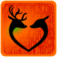

# Couple-quest 
>### [Latest release](https://github.com/Couple-quest/Couple-quest/releases/latest)

Simple "board-like" game for couples.

Rewrited in GDScript

Using [Godot Engine](https://godotengine.org/)

### Contribute
##### Add own modul with tasks.
Tasks are stored in [/data](/data) in scipt as lists.
In module are tasks sorted in 8 separate list, 4 for each gender
Game have three phases I > R > V. (_IOn_, _ROn_, _VOn_ are tasks for him) (_IOna_, _ROna_, _VOna_ are tasks for her)
Player which first gain 15 points are rewarded with task from _Ona_ (for him) or _On_ (for her).

Task modul would by selected by varibale`data` in script, these curently isn't implemented. (curently have czech and english tasks in [cs](/data/cs.gd) and [en](/data/en.gd))

##### see [issues](https://github.com/Couple-quest/Couple-quest/issues)

### In game screenshots

